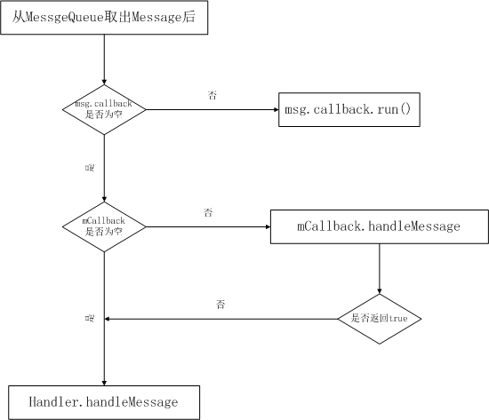

# Handler

Android线程通信之Handler

+ [Handler简介](#Handler简介)
+ [Handler的基本用法](#Handler的基本用法)
+ [Handler机制](#Handler机制)
    + [创建Handler](#创建Handler)
    + [ThreadLocal的工作原理](#ThreadLocal的工作原理)
    + [Looper.loop()方法](#Looper.loop()方法)
    + [MessageQueue](#MessageQueue)
    + [消息的处理](#消息的处理)
    + [退出Looper循环](#退出Looper循环)
+ [主线程的循环系统](#主线程的循环系统)
+ [Handler总结](#Handler总结)


## Handler简介

我们知道，Android为了确保UI操作的线程安全，规定所有的UI操作都必须在主线程（UI线程）中执行，比如更新界面元素的显示，响应用户的点击事件等，但是有时候我们必须执行一些耗时的操作，比如网络请求或者读写文件等，当耗时操作完成后我们需要更新UI提示用户，在这种情况下，我们是不能将耗时操作直接在UI线程中执行的，因为这样会阻塞UI线程，导致UI线程无法及时更新界面元素或者响应用户，这样就会造成界面卡顿，如果阻塞时间过长，还会导致ANR，Android规定，Activity如果5秒之内无法响应用户的操作，或者BroadcastReceiver如果10秒之内还未执行完操作，就会出现ANR。也就是说，我们即不能在UI线程中执行耗时操作，又必须在UI线程中执行UI相关的操作，这样就必须让线程之间能够通信，我们开启一个子线程来执行耗时操作，在耗时操作完成后，子线程向UI线程发送一个消息通知UI线程，UI线程接受到消息后，执行相关的UI操作。在Android中，线程之间的通信采用的机制就是Handler机制，Handler能够方便的切换执行任务的线程。

## Handler的基本用法

下面模拟开启一个子线程执行耗时任务后更新UI的操作，代码如下：

``` java
import android.os.Bundle;
import android.os.Handler;
import android.os.Message;
import android.support.v7.app.AppCompatActivity;
import android.util.Log;
import android.view.View;
import android.widget.Button;
import android.widget.TextView;
import com.liunian.androidbasic.R;
import java.lang.ref.WeakReference;
 
public class HandlerTestActivity extends AppCompatActivity {
    public static String TAG = "HandlerTestActivity";
    TextView mShowTextView;
    Button mStartDownLoadButton;
    private Handler mHandler;
 
    @Override
    protected void onCreate(Bundle savedInstanceState) {
        super.onCreate(savedInstanceState);
        setContentView(R.layout.activity_handler_test);
        mHandler = new MyHandler(this);
        mShowTextView = (TextView) findViewById(R.id.show_text);
        mStartDownLoadButton = (Button) findViewById(R.id.start_download);
        mStartDownLoadButton.setOnClickListener(new View.OnClickListener() {
            @Override
            public void onClick(View v) {
                new DownloadImageThread(mHandler).start();
            }
        });
    }
 
    @Override
    protected void onDestroy() {
        super.onDestroy();
        // 在Activity销毁后移除Handler中未处理完的消息，避免内存泄露或者发生引用错误
        mHandler.removeMessages(DownloadImageThread.DOWNLOAD_IMAGE_FINISH);
    }
 
    // Handler类，声明为static，避免持有外部类的直接引用，防止内存泄露
    private static class MyHandler extends Handler {
        private WeakReference<HandlerTestActivity> activityWeakReference; // 持有外部类的弱引用
        public MyHandler(HandlerTestActivity activity) {
            activityWeakReference = new WeakReference<HandlerTestActivity>(activity);
        }
 
        @Override
        public void handleMessage(Message msg) {
            switch (msg.what) {
                case DownloadImageThread.DOWNLOAD_IMAGE_FINISH: // 处理下载完成消息，更新UI
                    HandlerTestActivity handlerTestActivity = activityWeakReference.get();
                    if (handlerTestActivity != null) {
                        handlerTestActivity.mShowTextView.setText((String)msg.obj);
                    }
                    break;
            }
        }
    }
 
    // 模拟下载图片的子线程
    public static class DownloadImageThread extends Thread { // 将Thread声明为static，非静态内部类或者匿名类默认持有外部类对象的引用，容易造成内存泄露
        public static final int DOWNLOAD_IMAGE_FINISH = 1;
        private WeakReference<Handler> handlerWeakReference;
        public DownloadImageThread(Handler handler) { // 采用弱引用的方式持有Activity中Handler对象的引用，避免内存泄露
            handlerWeakReference = new WeakReference<Handler>(handler);
        }
        @Override
        public void run() {
            Log.i(TAG, "子线程开始下载图片");
            // 模拟下载图片
            for (int i=1; i<=100; i++) {
                try {
                    Thread.sleep(60);
                    Log.i(TAG, "下载进度:" + i + "%");
                } catch (InterruptedException e) {
                    e.printStackTrace();
                }
            }
 
            Log.i(TAG, "子线程下载图片完成");
            // 发送消息通知UI线程下载完毕
            Message message = Message.obtain();
            message.what = DOWNLOAD_IMAGE_FINISH;
            message.obj = "图片下载完成";
            Handler handler = handlerWeakReference.get();
            if (handler != null) {
                handler.sendMessage(message);
            }
        }
    }
}
```

上面是使用Handler更新UI的典型用法，要注意两点：

1、不要使用匿名类或者非静态内部类，因为它们默认持有外部类对象的引用，这样当Activity调用onDestory后，如果Handler中的消息还没有处理完毕（消息对象持有Handler的引用），或者Thread没有执行完毕，Activity对象就会被内部类或匿名类的对象所引用，从而导致Activity对象无法被GC回收，产生内存泄露。所以我们要采用静态内部类，用弱引用的方式持有外部类的引用，避免内存泄露。

2、在onDestroy中调用Handler的removeMessages或者removeCallbacks方法，移除Handler中未处理完的消息，避免在 onDestroy 方法中释放了一些资源，此时Handler 执行到 handlerMessage 方法，但相关资源已经被释放，从而引起异常，或者我们可以给handlerMessage加上try catch来避免空指针异常。

匿名类或者非静态内部类使用Handler造成内存泄露的引用链如下：

主线程Thread对象->主线程Looper对象->Looper对象持有的MessageQueue对象->Message对象->Handler对象->Activity（或其他外部类）对象

只有Message从消息队列取出被消耗了，引用链才会断开。

## Handler机制

Android的消息机制主要是指Handler机制，Handler的运行需要底层的MessageQueue和Looper的支撑。MessageQueue即消息队列，它的内部存储了一组消息，以队列的形式对外提供插入和删除的操作；MessageQueue只是一个消息的存储单元，它并不会去处理消息，而Looper就填补了这个功能，其内部会以无限循环的方式去查找消息队列里面是否有消息，如果有的话就处理消息，否则就一直等待。我们知道，Handler创建的时候会采用当前线程的Looper来构造消息循环系统，我们在创建Handler时，必须为Handler指定Looper对象，后面该Handler发送的消息就都由Looper对象处理，如果没有指定Looper，默认使用当前线程的Looper对象，如果当前线程没有Looper对象，则创建Handler将会报错，线程默认是没有Looper的，之所以可以在UI线程中创建Handler不指定Looper，是因为UI线程在ActivityThread的入口函数中已经初始化了Looper。下面我们从源码入手，一起来分析一下Handler机制。

先来看一下Handler机制的图解：


### 创建Handler

首先，我们开启一个子线程，并且在子线程中new 一个Handler对象，如下：
``` java
        new Thread(new Runnable() {
            @Override
            public void run() {
                Handler handler = new Handler();
            }
        }).start();
```

运行程序，发现直接闪退，报错内容如下：

``` java
E/AndroidRuntime: FATAL EXCEPTION: Thread-xx
        Process: xx, PID: xx
        java.lang.RuntimeException: Can't create handler inside thread that has not called Looper.prepare()
            at android.os.Handler.<init>(Handler.java:200)
            at android.os.Handler.<init>(Handler.java:114)
            at com.test.xx$2.run(xx.java:37)
            at java.lang.Thread.run(Thread.java:818)
```

提示不能在没有调用Looper.prepare()的线程中创建Handler，为什么会这样呢？打开Handler源码：

``` java
    public Handler() {
        this(null, false);
    }
 
 
    public Handler(Callback callback, boolean async) {
        if (FIND_POTENTIAL_LEAKS) {
            final Class<? extends Handler> klass = getClass();
            if ((klass.isAnonymousClass() || klass.isMemberClass() || klass.isLocalClass()) &&
                    (klass.getModifiers() & Modifier.STATIC) == 0) {
                Log.w(TAG, "The following Handler class should be static or leaks might occur: " +
                    klass.getCanonicalName());
            }
        }
 
        // 调用Looper.myLooper()，获得当前线程的Looper对象
        mLooper = Looper.myLooper(); 
        if (mLooper == null) { 
            // 如果没有Looper对象则会抛出异常
            throw new RuntimeException(
                "Can't create handler inside thread that has not called Looper.prepare()");
        }
        // 存储当前线程Looper的MessageQueue对象
        mQueue = mLooper.mQueue; 
        mCallback = callback;
        mAsynchronous = async;
    }
```

很明显，通过Looper.myLooper()获得当前线程的Looper对象时，没有找到当前线程的Looper对象，所以创建Handler时就抛出了异常。Looper.myLooper()的代码：
``` java
    /**
     * Return the Looper object associated with the current thread.  Returns
     * null if the calling thread is not associated with a Looper.
     */
    public static @Nullable Looper myLooper() {
        return sThreadLocal.get(); // 从ThreadLocal对象中取出当前线程的Looper
    }
```

我们继续分析Looper.prepare()的代码：
``` java
    public static void prepare() {
        prepare(true);
    }
 
    private static void prepare(boolean quitAllowed) {
        // 如果当前线程已经有了Looper对象，再次调用prepare会抛出异常
        if (sThreadLocal.get() != null) { 
            throw new RuntimeException("Only one Looper may be created per thread");
        }
        // 生成一个Looper对象，并与当前线程关联起来
        sThreadLocal.set(new Looper(quitAllowed)); 
    }
```

可以看到，Looper.prepare()会生成一个Looper对象，通过ThreadLocal与当前线程关联起来，ThreadLocal是一个线程内部的数据存储类，通过它可以在指定的线程中存储数据，后面我们会分析它的原理，通过代码我们还可以知道，一个线程只能调用一次Looper.prepare()，多次调用会抛出异常。

### ThreadLocal的工作原理

ThreadLocal是一个线程内部的数据存储类，通过它可以在指定的线程中存储数据，数据存储后，只有在指定线程中可以获得到存储的数据，对于其他线程来说则无法获取。一般来说，当某些数据是以线程为作用域并且不同线程有不同的数据副本时，就可以考虑采用ThreadLocal。比如对于Looper来说，它的作用域就是线程，不同的线程可以拥有0个到1个Looper对象，通过ThreadLocal，我们可以很轻松的获得当前线程的Looper对象。下面看一下ThreadLocal的用法，以Looper为例：

a、创建ThreadLocal对象
``` java
    static final ThreadLocal<Looper> sThreadLocal = new ThreadLocal<Looper>();
```
b、设置当前线程的Looper对象
``` java
    sThreadLocal.set(new Looper(quitAllowed));
```
c、获得当前线程的Looper对象
``` java
    sThreadLocal.get()
```

代码非常简单，下面我们分析一下ThreadLocal的源码：

1、构造方法
``` java
    public ThreadLocal() {
    }
```
构造方法没有做任何处理

2、set方法

``` java
    public void set(T value) {
        Thread t = Thread.currentThread(); // 获得当前线程对象
        ThreadLocalMap map = getMap(t); // 获得当前线程对应的ThreadLocalMap
        if (map != null)
            map.set(this, value); // 如果当前线程有ThreadLocalMap对象，则直接将数据存储在map中
        else
            createMap(t, value); // 如果当前线程没有ThreadLocalMap对象，则创建一个ThreadLocalMap对象并将数据存储在map中
    }
```

通过上面的代码我们发现，ThreadLocal在存储数据时，会先获得当前线程的ThreadLocalMap对象，并且将数据存储在其中，存储是以ThreadLocal对象为key，以实际存储数据为value，不同的线程有不同的ThreadLocalMap对象，这样就确保了每个线程的数据不会相互干扰。

3、getMap方法

``` java
    ThreadLocalMap getMap(Thread t) {
        return t.threadLocals; // 返回线程对象中的threadLocals
    }
 
    public class Thread implements Runnable {
 
        ThreadLocal.ThreadLocalMap threadLocals = null; // 在线程类中有声明ThreadLocalMap对象
    }
```

从这里可以看到，getMap方法其实就是获得线程中声明的ThreadLocalMap对象，每一个线程都维护着自己的的ThreadLocalMap

4、createMap方法
``` java
    void createMap(Thread t, T firstValue) {
        t.threadLocals = new ThreadLocalMap(this, firstValue);
    }
    
    ThreadLocalMap(ThreadLocal firstKey, Object firstValue) { // 已ThreadLocal对象作为key，以需要存储的值作为value保存数据
        table = new Entry[INITIAL_CAPACITY];
        int i = firstKey.threadLocalHashCode & (INITIAL_CAPACITY - 1);
        table[i] = new Entry(firstKey, firstValue);
        size = 1;
        setThreshold(INITIAL_CAPACITY);
    }
```

createMap方法会创建一个ThreadLocalMap对象并且将值存储在其中

5、get方法

``` java
    public T get() {
        Thread t = Thread.currentThread(); // 获得当前线程
        ThreadLocalMap map = getMap(t); // 获得当前线程的ThreadLocalMap对象
        if (map != null) { // 从当前线程中的ThreadLocalMap对象中取出对应的值并返回
            ThreadLocalMap.Entry e = map.getEntry(this);
            if (e != null)
                return (T)e.value;
        }
        return setInitialValue();
    }
```

6、ThreadLocalMap存储数据的方式

在上面的代码中，我们知道ThreadLocal会将数据保存在当前线程的ThreadLocalMap对象中，保存时会以ThreadLocal对象作为key，以要保存的对象作为value，取出数据时，则会以ThreadLocal对象作为索引，找到当前的线程的ThreadLocalMap对象中保存的数据。

### Looper.loop()方法

下面我们开启一个线程，在该线程下创建Looper和Handler，并且开启另外一个线程给其发送一个消息，代码如下：

``` java
    private HandlerTestThread mHandlerTestThread;
    private class HandlerTestThread extends Thread {
        public Handler mHandler;
        @Override
        public void run() {
            Log.i(TAG, "HandlerTestThread start"); // 线程开始
            Looper.prepare();
            mHandler = new Handler() {
                @Override
                public void handleMessage(Message msg) {
                    Log.i(TAG, "handlerMessage"); // 处理消息
                }
            };
            Log.i(TAG, "HandlerTestThread end"); // 线程结束
        }
    }
 
    @Override
    protected void onCreate(Bundle savedInstanceState) {
        super.onCreate(savedInstanceState);
        setContentView(R.layout.activity_handler_test);
 
        mHandlerTestThread = new HandlerTestThread();
        mHandlerTestThread.start();
        new Thread(new Runnable() {
            @Override
            public void run() {
                try {
                    Thread.sleep(1000); // 休眠一秒在发送消息，确保HandlerTestThread线程已经启动
                } catch (InterruptedException e) {
                    e.printStackTrace();
                }
                Message message = Message.obtain();
                mHandlerTestThread.mHandler.sendMessage(message); // 发送一个消息
            }
        }).start();
    }
```

运行程序，打印日志如下：
``` java
07-26 14:30:42.043 324-398/? I/HandlerTestActivity: HandlerTestThread start
07-26 14:30:42.043 324-398/? I/HandlerTestActivity: HandlerTestThread end
```

通过日志可以发现，HandlerTestThread在启动之后立马就结束了，并没有处理另外一个子线程发送过来的消息，我们可以想一下，既然HandlerTestThread要处理消息，那么其必然不能结束，并且应该处于等待状态，一旦有消息过来立马处理，我们在调用Looper.prepare()时仅仅是为当前线程创建了一个Looper对象，而要让Looper正式开始工作，还需要调用Looper.loop()方法，如下：
``` java
    private class HandlerTestThread extends Thread {
        public Handler mHandler;
        @Override
        public void run() {
            Log.i(TAG, "HandlerTestThread start");
            Looper.prepare();
            mHandler = new Handler() {
                @Override
                public void handleMessage(Message msg) {
                    Log.i(TAG, "handlerMessage");
                }
            };
            Looper.loop(); // 让Looper开始工作
            Log.i(TAG, "HandlerTestThread end");
        }
    }
```
打印日志如下：
``` java
07-26 14:43:04.890 2841-3133/? I/HandlerTestActivity: HandlerTestThread start
07-26 14:43:05.891 2841-3133/? I/HandlerTestActivity: handlerMessage
```

通过日志，可以看到Handler成功处理了发送过来的消息，并且线程没有结束，这是因为Looper.loop()会构造一个循环系统，随时监控消息队列中是否有消息需要处理，如果有则立马处理，如果没有，则会阻塞线程直到有消息需要处理；除非我们调用相应的退出循环的方法，线程才能结束。

下面我们一起分析一下Looper.loop()的源码：
``` java
    public static void loop() {
        final Looper me = myLooper(); // 获得当前线程的Looper对象
        if (me == null) {
            throw new RuntimeException("No Looper; Looper.prepare() wasn't called on this thread.");
        }
        final MessageQueue queue = me.mQueue; // 获得消息队列
 
        // Make sure the identity of this thread is that of the local process,
        // and keep track of what that identity token actually is.
        Binder.clearCallingIdentity();
        final long ident = Binder.clearCallingIdentity();
 
        // 开启循环
        for (;;) {
            Message msg = queue.next(); // might block从队列中获得消息，如果没有消息将会阻塞
            if (msg == null) {
                // No message indicates that the message queue is quitting.
                return;
            }
 
            // This must be in a local variable, in case a UI event sets the logger
            final Printer logging = me.mLogging;
            if (logging != null) {
                logging.println(">>>>> Dispatching to " + msg.target + " " +
                        msg.callback + ": " + msg.what); // 开始处理消息的日志打印
            }
 
            final long traceTag = me.mTraceTag;
            if (traceTag != 0 && Trace.isTagEnabled(traceTag)) {
                Trace.traceBegin(traceTag, msg.target.getTraceName(msg));
            }
            try {
                msg.target.dispatchMessage(msg); // 处理消息
            } finally {
                if (traceTag != 0) {
                    Trace.traceEnd(traceTag);
                }
            }
 
            if (logging != null) {
                logging.println("<<<<< Finished to " + msg.target + " " + msg.callback); // 处理消息完成的日志打印
            }
 
            // Make sure that during the course of dispatching the
            // identity of the thread wasn't corrupted.
            final long newIdent = Binder.clearCallingIdentity();
            if (ident != newIdent) {
                Log.wtf(TAG, "Thread identity changed from 0x"
                        + Long.toHexString(ident) + " to 0x"
                        + Long.toHexString(newIdent) + " while dispatching to "
                        + msg.target.getClass().getName() + " "
                        + msg.callback + " what=" + msg.what);
            }
 
            msg.recycleUnchecked(); // 回收消息对象，可以利用Message.obtain()重复利用消息对象
        }
    }
```

可以看到，loop方法会构造一个循环，然后从消息队列中取出消息并处理，处理完成后回收消息对象，如果消息队列中没有消息则MessageQueue.next会阻塞线程直到有新的消息需要处理。

这里有一个注意的点，我们可以看到在调用dispatchMessage处理消息前后都会打印日志，打印对象可以自行设置，Looper提供了如下方法：
``` java
    public void setMessageLogging(@Nullable Printer printer) {
        mLogging = printer;
    }
```

注意，这是一个public方法，也就是开发者也可以调用，那么我们是不是可以利用这一点来统计每一个Message的处理时间呢？获得消息处理前的系统时间和处理后的系统时间，两者相减就能知道本次消息的处理时间，这样，我们就能知道哪些消息的处理是比较耗时的操作，我们可以利用这一方式来检测UI线程的卡顿情况，主要原理就是利用Looper的Printer获得每一个消息的处理时间，如果发现某个消息处理太耗时了，那么肯定会造成主线程卡顿，卡顿检测框架BlockCanary就是这个原理，下面是它的核心代码：

``` java
class LooperMonitor implements Printer { // 自定义Looper的Printer，检测卡顿
  @Override
  public void println(String x) {
      if (!mPrintingStarted) {
          mStartTimestamp = System.currentTimeMillis(); // 记录当前时间为处理消息前时间
          mStartThreadTimestamp = SystemClock.currentThreadTimeMillis();
          mPrintingStarted = true;
          startDump(); // 收集主线程堆栈、CPU等信息，在子线程中处理
      } else {
          final long endTime = System.currentTimeMillis(); // // 记录当前时间为处理消息后时间
          mPrintingStarted = false;
          if (isBlock(endTime)) { // 判断处理当前消息是否耗时，如果耗时则显示通知
              notifyBlockEvent(endTime);
          }
          stopDump(); // 停止收集主线程堆栈、CPU等信息
      }
  }
 
  private boolean isBlock(long endTime) {
      return endTime - mStartTimestamp > mBlockThresholdMillis; // 处理消息时间是否大于某个阈值
  }
 
  // ignore other codes...
}
 
 
Looper.getMainLooper().setMessageLogging(mBlockCanaryCore.monitor); // 给主线程Looper对象设置自定义的Printer对象，mBlockCanaryCore.monitor是LooperMonitor类的对象
```

### MessageQueue
顾名思义，MessageQueue的中文含义表示消息队列，它的作用是用来存储消息对象的，并且提供相应的插入、取出操作，首先我们看一下Handler的sendMessage方法：
``` java 
    public final boolean sendMessage(Message msg)
    {
        return sendMessageDelayed(msg, 0);
    }
 
    public final boolean sendMessageDelayed(Message msg, long delayMillis)
    {
        if (delayMillis < 0) {
            delayMillis = 0;
        }
        return sendMessageAtTime(msg, SystemClock.uptimeMillis() + delayMillis);
    }
 
    public boolean sendMessageAtTime(Message msg, long uptimeMillis) {
        MessageQueue queue = mQueue; // mQueue是创建Handler的线程的消息队列对象
        if (queue == null) {
            RuntimeException e = new RuntimeException(
                    this + " sendMessageAtTime() called with no mQueue");
            Log.w("Looper", e.getMessage(), e);
            return false;
        }
        return enqueueMessage(queue, msg, uptimeMillis); // 将消息插入到消息队列
    }
 
    private boolean enqueueMessage(MessageQueue queue, Message msg, long uptimeMillis) { // 最终都是调用这个方法插入消息
        msg.target = this; // 让消息对象的target指向当前Handler对象，这里需要注意，Message就是在这里持有Handler的引用的
        if (mAsynchronous) {
            msg.setAsynchronous(true);
        }
        return queue.enqueueMessage(msg, uptimeMillis); // 将消息插入到消息队列中
    }
```

可以看到，Handler的sendMessage方法最终都是调用了MessageQueue的enqueueMessage方法，将消息插入到消息队列中。

1、MessageQueue.enqueueMessage
``` java
    boolean enqueueMessage(Message msg, long when) {
        if (msg.target == null) { // 每个消息都需要有target对象，这个target就是最终处理消息的Handler对象
            throw new IllegalArgumentException("Message must have a target.");
        }
        if (msg.isInUse()) {
            throw new IllegalStateException(msg + " This message is already in use.");
        }
 
        synchronized (this) { // 加上控制锁，保证线程安全
            if (mQuitting) { // 如果消息循环已经退出，将不会将消息插入到队列中
                IllegalStateException e = new IllegalStateException(
                        msg.target + " sending message to a Handler on a dead thread");
                Log.w(TAG, e.getMessage(), e);
                msg.recycle();
                return false;
            }
 
            msg.markInUse(); // 标记该消息对象已经插入到了消息队列中
            msg.when = when;
            Message p = mMessages; // 消息队列中第一个要处理的消息（优先级最高的消息），消息队列是以链表的形式存储的
            boolean needWake;
            if (p == null || when == 0 || when < p.when) { // 如果消息队列为空，或者当前消息的优先级大于消息队列中优先级最高的消息，则将当前消息设置为优先级最高的消息
                // New head, wake up the event queue if blocked.
                msg.next = p; // 指向下一个消息
                mMessages = msg; // 最为优先级最高的消息
                needWake = mBlocked; // 如果线程被阻塞了，则需要将其唤醒
            } else {
                // Inserted within the middle of the queue.  Usually we don't have to wake
                // up the event queue unless there is a barrier at the head of the queue
                // and the message is the earliest asynchronous message in the queue.
                needWake = mBlocked && p.target == null && msg.isAsynchronous();
                Message prev;
                for (;;) { // 找到消息队列中第一个优先级小于当前消息的消息
                    prev = p;
                    p = p.next;
                    if (p == null || when < p.when) {
                        break;
                    }
                    if (needWake && p.isAsynchronous()) {
                        needWake = false;
                    }
                }
                // 将消息插入按照优先级顺序插入到消息队列中
                msg.next = p; // invariant: p == prev.next
                prev.next = msg;
            }
 
            // We can assume mPtr != 0 because mQuitting is false.
            if (needWake) { // 判断线程是否需要重新被唤醒，如果需要则将线程唤醒
                nativeWake(mPtr);
            }
        }
        return true;
    }
```

从上面的代码中，可以看出，消息队列其实是以链表的形式来存储消息，每次插入消息时，都会判断队列中消息的优先级，并将消息插入到对应的位置，链表的优点是插入和删除数据效率高，只需要修改指针的引用关系即可。

2、MessageQueue.next()

在Looper中会调用MessageQueue.next()方法来从消息队列中取出需要处理的消息，MessageQueue.next()的源码如下：
``` java
    Message next() {
        // Return here if the message loop has already quit and been disposed.
        // This can happen if the application tries to restart a looper after quit
        // which is not supported.
        final long ptr = mPtr; // 这个是和native方法交流的指针
        if (ptr == 0) {
            return null;
        }
 
        int pendingIdleHandlerCount = -1; // -1 only during first iteration
        int nextPollTimeoutMillis = 0;
        for (;;) {
            if (nextPollTimeoutMillis != 0) {
                Binder.flushPendingCommands();
            }
 
            nativePollOnce(ptr, nextPollTimeoutMillis); // 调用native方法阻塞线程nextPollTimeoutMillis毫秒，-1表示一直阻塞直到调用了唤醒方法
 
            synchronized (this) {
                // Try to retrieve the next message.  Return if found.
                final long now = SystemClock.uptimeMillis(); // 获得当前时间
                Message prevMsg = null;
                Message msg = mMessages; // 队列中优先级最高的消息
                if (msg != null && msg.target == null) { // 如果优先级最高的消息没有处理它的目标（Handler），则表明其是一个异步消息，我们通过Handler发送的消息都是同步消息，这个在Handler的enqueueMessage方法中可以看到，这里会一直循环知道找到一个同步消息
                    // Stalled by a barrier.  Find the next asynchronous message in the queue.
                    do {
                        prevMsg = msg;
                        msg = msg.next;
                    } while (msg != null && !msg.isAsynchronous());
                }
                if (msg != null) {
                    if (now < msg.when) { // 如果当前时间小于消息开始执行的时间，则设置阻塞时间为开始执行的时间减去当前时间
                        // Next message is not ready.  Set a timeout to wake up when it is ready.
                        nextPollTimeoutMillis = (int) Math.min(msg.when - now, Integer.MAX_VALUE);
                    } else { // 否则从队里中取出这条消息并返回
                        // Got a message.
                        mBlocked = false; // 设置阻塞状态为非阻塞，因为马上会调用return方法结束该方法
                        // 从队里中移除该消息并返回
                        if (prevMsg != null) {
                            prevMsg.next = msg.next;
                        } else {
                            mMessages = msg.next;
                        }
                        msg.next = null;
                        if (DEBUG) Log.v(TAG, "Returning message: " + msg);
                        msg.markInUse();
                        return msg;
                    }
                } else { // 没有消息
                    // No more messages.
                    nextPollTimeoutMillis = -1;
                }
 
                // Process the quit message now that all pending messages have been handled.
                if (mQuitting) { // 如果退出了Looper循环则直接返回空
                    dispose();
                    return null;
                }
 
                // If first time idle, then get the number of idlers to run.
                // Idle handles only run if the queue is empty or if the first message
                // in the queue (possibly a barrier) is due to be handled in the future.
                if (pendingIdleHandlerCount < 0
                        && (mMessages == null || now < mMessages.when)) {
                    pendingIdleHandlerCount = mIdleHandlers.size();
                }
                if (pendingIdleHandlerCount <= 0) {
                    // No idle handlers to run.  Loop and wait some more.
                    mBlocked = true;
                    continue;
                }
 
                if (mPendingIdleHandlers == null) {
                    mPendingIdleHandlers = new IdleHandler[Math.max(pendingIdleHandlerCount, 4)];
                }
                mPendingIdleHandlers = mIdleHandlers.toArray(mPendingIdleHandlers);
            }
 
            // Run the idle handlers.
            // We only ever reach this code block during the first iteration.
            for (int i = 0; i < pendingIdleHandlerCount; i++) {
                final IdleHandler idler = mPendingIdleHandlers[i];
                mPendingIdleHandlers[i] = null; // release the reference to the handler
 
                boolean keep = false;
                try {
                    keep = idler.queueIdle();
                } catch (Throwable t) {
                    Log.wtf(TAG, "IdleHandler threw exception", t);
                }
 
                if (!keep) {
                    synchronized (this) {
                        mIdleHandlers.remove(idler);
                    }
                }
            }
 
            // Reset the idle handler count to 0 so we do not run them again.
            pendingIdleHandlerCount = 0;
 
            // While calling an idle handler, a new message could have been delivered
            // so go back and look again for a pending message without waiting.
            nextPollTimeoutMillis = 0;
        }
    }
```

从上面的代码中，可以看出，Message的next()方法也是一个循环，退出循环的条件是有符合条件的消息出现，或者Looper结束了工作，在循环中，首先会找到消息队列中优先级最高的消息，如果没有消息，则会一直阻塞线程直到有新的消息加入唤醒线程才会继续工作；如果有消息，则会将消息的开始执行时间和当前时间做比较，如果消息的开始执行时间小于或者等于当前时间，说明消息应该要执行了，则会将消息从队列中移除并返回该消息，loop循环中则会执行这条消息；如果消息的开始执行时间大于当前时间，则说明还没有到达消息开始执行的时间，这个时候就会用优先级最高的消息的开始执行时间减去当前时间，然后阻塞线程对应的时间。

MessageQueue的代码就分析到这里，MessageQueue是消息的存储单元，其内部是通过链表来实现的，并且提供了插入和取出消息的方法；在插入消息时，MessageQueue会计算消息的优先级（按照开始执行的时间），优先级越高的消息越靠前，在插入消息后，如果处理消息的线程阻塞，则会唤醒处理消息的线程。在取出消息时，MessageQueue会判断消息队列中是否有消息，如果没有消息则直接阻塞线程，如果有消息，则会取出当前优先级最高的消息，然后将消息的开始执行时间和当前时间做比较，如果消息的开始执行时间小于或者等于当前时间，说明消息应该要执行了，则会将消息从队列中移除并返回该消息，loop循环中则会执行这条消息；如果消息的开始执行时间大于当前时间，则说明还没有到达消息开始执行的时间，这个时候就会用优先级最高的消息的开始执行时间减去当前时间，然后阻塞线程对应的时间。这里要注意一点，MessageQueue插入消息可以在任何线程中执行，但是取出消息则只会在执行loop循环的线程中执行。

### 消息的处理

通过对Looper.loop的代码分析，我们知道，取出消息后，Looper是调用如下代码处理消息的：
``` java
 msg.target.dispatchMessage(msg); // 处理消息
```

而msg.target就是我们发送消息的Handler，这个在Handler的enqueueMessage中可以看到：
```  java
    private boolean enqueueMessage(MessageQueue queue, Message msg, long uptimeMillis) {
        msg.target = this; // 让消息的target指向当前Handler对象
        if (mAsynchronous) {
            msg.setAsynchronous(true);
        }
        return queue.enqueueMessage(msg, uptimeMillis);
    }
```

我们继续查看Handler的dispatchMessage方法：
``` java
    public void dispatchMessage(Message msg) {
        if (msg.callback != null) { // 如果message设置了callback，则优先调用callback处理消息
            handleCallback(msg);
        } else {
            if (mCallback != null) { // 如果Handler设置了callback，则会调用Handler的callback处理消息，并且根据返回状态来决定是否要执行handleMessage方法
                if (mCallback.handleMessage(msg)) {
                    return;
                }
            }
            handleMessage(msg); // 调用Handler的handleMessage方法处理消息
        }
    }
 
    private static void handleCallback(Message message) {
        message.callback.run();
    }
 
    // 定义处理消息的接口
    public interface Callback {
        public boolean handleMessage(Message msg);
    }
```

可以看到，Handler在处理消息时，首先会判断当前Message对象有没有设置callback，如果有设置，这直接调用Message的callback的run方法来处理消息；如果消息没有设置callback，则首先会判断自己是否有设置Callback，如果有，则调用自身Callback的handlerMessage方法来处理消息，并且根据返回状态来觉得是否继续执行Handler的HandlerMessage方法。

Handler处理消息流程图：


我们在调用Handler的post方法来发送消息时，其实就是构造了一个带callback的Message对象，然后插入到消息队列中，代码如下：
``` java
    mHandlerTestThread.mHandler.post(new Runnable() {
        @Override
        public void run() {
 
        }
    });
 
 
    public final boolean post(Runnable r)
    {
       return  sendMessageDelayed(getPostMessage(r), 0);
    }
 
    private static Message getPostMessage(Runnable r) {
        Message m = Message.obtain();
        m.callback = r; // 构造一个带callback的Message对象
        return m;
    }
```

### 退出Looper循环
通过前面的分析我们知道，在线程中调用Looper.loop()开启当前线程的循环系统后，程序将会执行一个循环，如果不调用相应的退出方法，则无法退出循环，线程也无法结束，Looper提供了quit和quitSafely方法来退出循环：
``` java
    public void quit() {
        mQueue.quit(false);
    }
 
    public void quitSafely() {
        mQueue.quit(true);
    }
```

可以看到，这两个方法都是调用了MessageQueue的quit方法来退出循环：
``` java
    void quit(boolean safe) {
        if (!mQuitAllowed) { // 表示是否能够退出循环系统，只有主线程无法退出，其他线程都可以退出
            throw new IllegalStateException("Main thread not allowed to quit.");
        }
 
        synchronized (this) {
            if (mQuitting) {
                return;
            }
            mQuitting = true; // 设置退出标识位为true
 
            if (safe) { // 如果是安全退出，则会将消息队列中能够执行的消息都执行完
                removeAllFutureMessagesLocked();
            } else { // 如果不是安全退出，则直接清空消息队列中的消息
                removeAllMessagesLocked();
            }
 
            // We can assume mPtr != 0 because mQuitting was previously false.
            nativeWake(mPtr); // 唤醒线程
        }
    }
```

``` java
    private void removeAllFutureMessagesLocked() { // 执行消息队列中当前时间可以执行的消息
        final long now = SystemClock.uptimeMillis(); // 获取系统当前时间
        Message p = mMessages; // 消息队列中优先级最高的消息
        if (p != null) {
            if (p.when > now) { // 如果优先级最高的消息的开始执行时间都大于当前时间，说明消息队列中当前时间没有可以执行的消息
                removeAllMessagesLocked(); // 清空消息队列
            } else {
                // 执行消息队列中当前时间可以执行的消息并清空消息队列
                Message n;
                for (;;) {
                    n = p.next;
                    if (n == null) {
                        return;
                    }
                    if (n.when > now) {
                        break;
                    }
                    p = n;
                }
                p.next = null;
                do {
                    p = n;
                    n = p.next;
                    p.recycleUnchecked();
                } while (n != null);
            }
        }
    }
 
    private void removeAllMessagesLocked() { // 清空消息队列
        Message p = mMessages;
        while (p != null) {
            Message n = p.next;
            p.recycleUnchecked();
            p = n;
        }
        mMessages = null;
    }
```

可以看到，quit和quitSafely的差别在于，quit会直接退出清空消息队列并退出Looper循环，而quitSafely则会先执行消息队列中当前时间可以执行的消息在退出Looper循环。

在MessageQueue的quit方法中，会将退出标识位mQuitting设置为true并唤醒线程，这个时候MessageQueue的next方法就会继续执行，而在next方法中，有如下代码：
``` java
                if (mQuitting) {
                    dispose();
                    return null;
                }
```

直接返回一个空对象，而在Looper的loop方法中，又有如下代码：
``` java
        for (;;) {
            Message msg = queue.next(); // might block
            if (msg == null) { // 如果消息返回为空，则直接退出循环
                // No message indicates that the message queue is quitting.
                return;
            }
            ...
        }
```

可以看到，如果MessageQueue.next()方法返回的消息对象为空，则loop方法会直接退出，这样就结束了循环系统。

## 主线程的循环系统
我们在主线程中使用Handler时，并没有调用Looper.prepare()方法来替主线程构造Looper对象，为什么主线程不用构造Looper对象呢？其实，主线程也是需要构造Looper对象并开启循环的，只不过这部分代码在主线程初始化的时候系统以及帮我们处理了，打开ActivityThread的源码，找到main方法：

``` java
    public static void main(String[] args) {
        ...
        Looper.prepareMainLooper(); // 构造主线程的Looper对象
        ...
        Looper.loop(); // 开启主线程的loop循环
        ...
    }
```

可以看到，主线程在初始化的时候就已经构造了循环系统，所有我们在主线程中使用Handler不需要再次构造循环系统，ActivityThread的main方法可以看做是一个应用的入口方法，其会初始化应用信息并开启主线程Looper循环，打开Looper.prepareMainLooper的源码：
``` java
    public static void prepareMainLooper() {
        prepare(false); // 这里传入的值是false，表示循环无法退出
        synchronized (Looper.class) {
            if (sMainLooper != null) {
                throw new IllegalStateException("The main Looper has already been prepared.");
            }
            sMainLooper = myLooper();
        }
    }
```

主线程构造Looper对象时，也是调用的prepare(boolean)方法，在普通线程中，我们构造Looper对象使用的是Looper.prepare()方法：
``` java
    public static void prepare() {
        prepare(true); // 普通线程构造Looper对象传入的是true，表示可以退出循环系统
    }
```

``` java
    private static void prepare(boolean quitAllowed) { // 传入true表示可以退出循环系统，false表示无法退出
        if (sThreadLocal.get() != null) {
            throw new RuntimeException("Only one Looper may be created per thread");
        }
        sThreadLocal.set(new Looper(quitAllowed));
    }
```

通过代码可以知道，主线程构造的Looper和普通线程构造的Looper的区别在于，主线程构造的Looper无法退出，除非应用被杀掉，而普通线程的Looper可以通过调用quit()或者quitSafely方法退出循环系统。从这点也可以看出，主线程其实就是一个Looper的死循环系统，不断的处理消息队列中的消息，主线程中所有进行的操作其实都是在Looper循环中执行的。比如界面的绘制、响应用户操作、Activity的生命周期回调方法执行等等。后面我们会详细分析Activity的启动过程和View的绘制过程。

## Handler总结

1、Handler是Android中非常重要的消息通信机制，通过它可以方便的切换任务运行的线程；

2、Handler底层离不开Looper、MessageQueue、ThreadLocal的支撑，Looper用来构造循环系统，MessageQueue用来存储消息单元，ThreadLocal用来为每个线程创建独立的数据；

3、主线程运行是基于Handler机制，通过Looper构造一个无法退出的死循环，主线程中所有的操作都需要在Looper循环中执行，通过Handler，Android的主线程可以说是基于消息驱动的模式；

4、在平时的开发中，很多地方都需要使用Handler，比如网络请求、读写比较大的文件等等，为了确保主线程不被阻塞，这些耗时操作就必须在子线程中进行，而在任务完成后需要更新界面，而由于Android的UI线程保护机制，UI相关的操作必须在主线程中完成，所有这个时候就必须使用Handler了，所以一些常见的网络框架或者需要使用到线程切换的框架，都会用到Handler。

5、在创建Handler时，尽量不要用匿名类或者非静态内部类，因为它们默认持有外部类的引用，这样容易造成内存泄露。