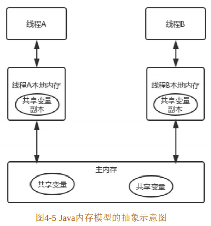

# volatile

- [volatile](#volatile)
  - [Java内存模型](#java内存模型)
  - [原子性、可见性和有序性](#原子性可见性和有序性)
    - [原子性](#原子性)
    - [可见性](#可见性)
    - [有序性](#有序性)
  - [volatile关键字](#volatile关键字)
  - [正确使用volatile关键字](#正确使用volatile关键字)
  - [小结](#小结)

## Java内存模型

Java中的堆内存用来存储对象实例，堆内存是被所有线程共享的运行时内存区域，因此，它存在内存可见性的问题。而局部变量、方法定义的参数则不会在线程之间共享，它们不会有内存可见性问题，也不受内存模型的影响。Java 内存模型定义了线程和主存之间的抽象关系：线程之间的共享变量存储在主存中，每个线程都有一个私有的本地内存，本地内存中存储了该线程共享变量的副本。需要注意的是本地内存是Java内存模型的一个抽象概念，其并不真实存在，它涵盖了缓存、写缓冲区、寄存器等区域。Java内存模型控制线程之间的通信，它决定一个线程对主存共享变量的写入何时对另一个线程可见。Java 内存模型的抽象示意图如下图所示。



线程A与线程B之间若要通信的话，必须要经历下面两个步骤：
（1）线程A把线程A本地内存中更新过的共享变量刷新到主存中去。
（2）线程B到主存中去读取线程A之前已更新过的共享变量。由此可见，如果我们执行下面的语句：
int i=3;
执行线程必须先在自己的工作线程中对变量 i 所在的缓存行进行赋值操作，然后再写入主存当中，而不
是直接将数值3写入主存当中。


## 原子性、可见性和有序性

那么Java语言本身对原子性、可见性以及有序性提供了哪些保证呢？首先我们要了解一下这3个特性。

### 原子性

对基本数据类型变量的读取和赋值操作是原子性操作，即这些操作是不可被中断的，要么执行完毕，
要么就不执行。现在看一下下面的代码，如下所示：
``` java
s = 3; //语句1
y = x; //语句2
x++；  //语句3
```
在上面3个语句中，只有语句1是原子性操作，其他两个语句都不是原子性操作。语句2虽说很短，但它
包含了两个操作，它先读取x的值，再将x的值写入工作内存。读取x的值以及将x的值写入工作内存这两个
操作单拿出来都是原子性操作，但是合起来就不是原子性操作了。语句3包括3个操作：读取x的值、对x的
值进行加1、向工作内存写入新值。通过这3个语句我们得知，一个语句含有多个操作时，就不是原子性操
作，只有简单地读取和赋值（将数字赋值给某个变量）才是原子性操作。java.util.concurrent.atomic 包中有
很多类使用了很高效的机器级指令（而不是使用锁）来保证其他操作的原子性。例如 AtomicInteger 类提供
了方法incrementAndGet和decrementAndGet，它们分别以原子方式将一个整数自增和自减。可以安全地使用
AtomicInteger类作为共享计数器而无须同步。另外这个包还包含AtomicBoolean、AtomicLong和
AtomicReference这些原子类，这仅供开发并发工具的系统程序员使用，应用程序员不应该使用这些类。

### 可见性

可见性，是指线程之间的可见性，一个线程修改的状态对另一个线程是可见的。也就是一个线程修改
的结果，另一个线程马上就能看到。当一个共享变量被volatile修饰时，它会保证修改的值立即被更新到主
存，所以对其他线程是可见的。当有其他线程需要读取该值时，其他线程会去主存中读取新值。而普通的
共享变量不能保证可见性，因为普通共享变量被修改之后，并不会立即被写入主存，何时被写入主存也是
不确定的。当其他线程去读取该值时，此时主存中可能还是原来的旧值，这样就无法保证可见性。

### 有序性

Java内存模型中允许编译器和处理器对指令进行重排序，虽然重排序过程不会影响到单线程执行的正确
性，但是会影响到多线程并发执行的正确性。这时可以通过volatile来保证有序性，除了volatile，也可以通
过synchronized和Lock来保证有序性。我们知道，synchronized和Lock保证每个时刻只有一个线程执行同步代
码，这相当于是让线程顺序执行同步代码，从而保证了有序性。

## volatile关键字

当一个共享变量被volatile修饰之后，其就具备了两个含义，一个是线程修改了变量的值时，变量的新
值对其他线程是立即可见的。换句话说，就是不同线程对这个变量进行操作时具有可见性。另一个含义是
禁止使用指令重排序。
这里提到了重排序，那么什么是重排序呢？重排序通常是编译器或运行时环境为了优化程序性能而采
取的对指令进行重新排序执行的一种手段。重排序分为两类：编译期重排序和运行期重排序，分别对应编
译时和运行时环境。
下面我们来看一段代码，假设线程1先执行，线程2后执行，如下所示：
``` java
// 线程1
boolean stop = false;
while(!stop){
    // do something
}

// 线程2
stop = false;
```

很多开发人员在中断线程时可能会采用这种方式。但是这段代码不一定会将线程中断。虽说无法中断
线程这个情况出现的概率很小，但是一旦发生这种情况就会造成死循环。为何有可能无法中断线程？在前
面我提到每个线程在运行时都有私有的工作内存，因此线程1在运行时会将stop变量的值复制一份放在私有
的工作内存中。当线程2更改了stop变量的值之后，线程2突然需要去做其他的操作，这时就无法将更改的
stop变量写入主存当中，这样线程1就不会知道线程2对stop变量进行了更改，因此线程1就会一直循环下
去。当stop用volatile修饰之后，那么情况就变得不同了，当线程2进行修改时，会强制将修改的值立即写入
主存，并且会导致线程1的工作内存中变量stop的缓存行无效，这样线程1再次读取变量stop的值时就会去主
存读取。

***volatile不保证原子性***<br>
我们知道volatile保证了操作的可见性，下面我们来分析volatile是否能保证对变量的操作是原子性的。
现在先阅读以下代码：

``` java
public class VolatileTest{
  public volatile int inc = 0;
  public void increase() {
    inc++;
  }

  public static void main(String[] args) {
    final VolatileTest test = new VolatileTest();
    for(int i = 0; i < 10; i++ ){
      new Thread(){
        public void run() {
          for(int j = 0; j < 1000; j++)
            test.increase();
        }
      }.start();
    }

    // 如果有子线程就让出资源，保证所有子线程都执行完
    while(Thread.activeCount()>12){
      Thread.yield();
    }
    System.out.println(test.inc);
  }
}
```

这段代码每次运行，结果都不一致。在前面已经提到过，自增操作是不具备原子性的，它包括读取变量的原始值、进行加 1、写入工作内存。也就是说，自增操作的 3 个子操作可能会分割开执行。假如某个时刻变量inc的值为9，线程1对变量进行自增操作，线程1先读取了变量inc的原始值，然后线程1被阻塞了。之后线程2对变量进行自增操作，线程2也去读取变量inc的原始值，然后进行加1操作，并把10写入工作内存，最后写入主存。随后线程1接着进行加1操作，因为线程1在此前已经读取了inc的值为9，所以不会再去主存读取最新的数值，线程1对inc进行加1操作后inc的值为10，然后将10写入工作内存，最后写入主存。两个线程分别对inc进行了一次自增操作后，inc的值只增加了1，因此自增操作不是原子性操作，volatile也无法保证对变量的操作是原子性的。

***volatile保证有序性***<br>
volatile关键字能禁止指令重排序，因此volatile能保证有序性。volatile关键字禁止指令重排序有两个含义：一个是当程序执行到volatile变量的操作时，在其前面的操作已经全部执行完毕，并且结果会对后面的操作可见，在其后面的操作还没有进行；在进行指令优化时，在volatile变量之前的语句不能在volatile变量后面执行；同样，在volatile变量之后的语句也不能在volatile变量前面执行。

## 正确使用volatile关键字

synchronized关键字可防止多个线程同时执行一段代码，那么这就会很影响程序执行效率。而volatile关键字在某些情况下的性能要优于synchronized。但是要注意volatile关键字是无法替代synchronized关键字的，因为volatile关键字无法保证操作的原子性。通常来说，使用volatile必须具备以下两个条件：
1. 对变量的写操作不会依赖于当前值。
2. 该变量没有包含在具有其他变量的不变式中。

第一个条件就是不能是自增、自减等操作，上文已经提到volatile不保证原子性。关于第二个条件，我们来举一个例子，它包含了一个不变式：下界总是小于或等于上界，代码如下所示：
``` java
public class NumberRange {
  private volatile int lower, upper;
  public int getLower(){
    return lower;
  }

  public int getUpper(){
    return upper;
  }

  public void setLower(int value){
    if(value > upper)
      throw new IllegalArgumentException(...);
    lower = value;
  }

  public void setUpper(int value) {
    if(value < upper)
      throw new IllegalArgumentException(...);
    value = lower;
  }
}
```

这种方式将lower和upper字段定义为volatile类型不能够充分实现类的线程安全。如果当两个线程在同一时间使用不一致的值执行setLower和setUpper的话，则会使范围处于不一致的状态。例如，如果初始状态是（0，5），在同一时间内，线程A调用setLower（4）并且线程B调用setUpper（3），虽然这两个操作交叉存入的值是不符合条件的，但是这两个线程都会通过用于保护不变式的检查，使得最后的范围值是（4，3）。这显然是不对的，因此使用 volatile 无法实现setLower和setUpper操作的原子性。

使用volatile有很多种场景，这里介绍其中的两种。
1. 状态标志
``` java
volatile boolean shutdownRequested;
...
public void shutdown(){
  shutdownRequested = true;
}

public void doWork() {
  whlie(!shutdownRequested){
    ...
  }
}
```

如果在另一个线程中调用 shutdown 方法，就需要执行某种同步来确保正确实现shutdownRequested 变量的可见性。但是，使用synchronized 块编写循环要比使用 volatile 状态标志编写麻烦很多。在这里推荐使用volatile，状态标志shutdownRequested 并不依赖于程序内的任何其他状态，并且还能简化代码。因此，此处适合使用volatile。

2. 双重检查模式（DCL）

``` java
public class Singleton{
  private volatile static Singleton instance = null;

  public static Singleton getInsteance() {
    if(instance == null){
      synchronized(this){
        if(instance == null){
          instance = new Singleton();
        }
      }
    }
    return instance;
  }
}
```

## 小结
与锁相比，volatile变量是一种非常简单但同时又非常脆弱的同步机制，它在某些情况下将提供优于锁的性能和伸缩性。如果严格遵循volatile的使用条件，即变量真正独立于其他变量和自己以前的值，在某些情况下可以使用volatile代替synchronized来简化代码。然而，使用volatile的代码往往比使用锁的代码更加容易出错。在前面的第 4 小节中介绍了可以使用 volatile 代替synchronized的最常见的两种用例，在其他情况下我们最好还是使用synchronized。