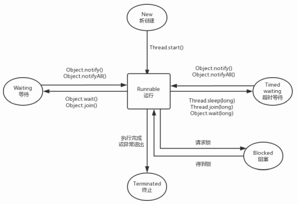

# 线程状态

Java线程在运行的声明周期中可能会处于6种不同的状态，这6种线程状态分别为如下所示。
+ New：新创建状态。线程被创建，还没有调用 start 方法，在线程运行之前还有一些基础工作要做。
+ Runnable：可运行状态。一旦调用start方法，线程就处于Runnable状态。一个可运行的线程可能正在运行也可能没有运行，这取决于操作系统给线程提供运行的时间。
+ Blocked：阻塞状态。表示线程被锁阻塞，它暂时不活动。
+ Waiting：等待状态。线程暂时不活动，并且不运行任何代码，这消耗最少的资源，直到线程调度器重新激活它。
+ Timed waiting：超时等待状态。和等待状态不同的是，它是可以在指定的时间自行返回的。
+ Terminated：终止状态。表示当前线程已经执行完毕。导致线程终止有两种情况：第一种就是run方法执行完毕正常退出；第二种就是因为一个没有捕获的异常而终止了run方法，导致线程进入终止状态。

如上图所示，线程创建后，调用 Thread 的 start 方法，开始进入运行状态，当线程执行wait 方法后，线程进入等待状态，进入等待状态的线程需要其他线程通知才能返回运行状态。超时等待相当于在等待状态加上了时间限制，如果超过时间限制，则线程返回运行状态。当线程调用到同步方法时，如果线程没有获得锁则进入阻塞状态，当阻塞状态的线程获取到锁时则重新回到运行状态。当线程执行完毕或者遇到意外异常终止时，都会进入终止状态。
