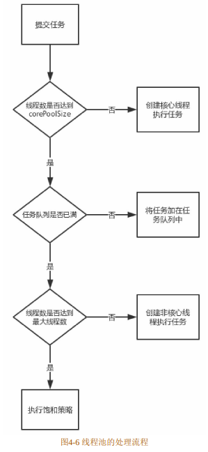
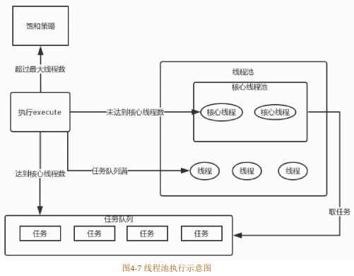
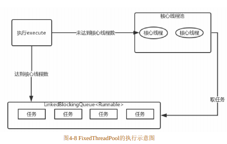
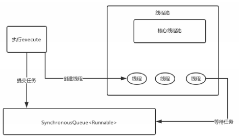
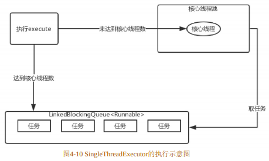
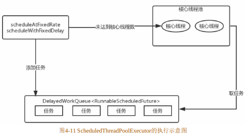

# 线程池

在编程中经常会使用线程来异步处理任务，但是每个线程的创建和销毁都需要一定的开销。如果每次执行一个任务都需要开一个新线程去执行，则这些线程的创建和销毁将消耗大量的资源；并且线程都是“各自为政”的，很难对其进行控制，更何况有一堆的线程在执行。这时就需要线程池来对线程进行管理。在Java 1.5中提供了Executor框架用于把任务的提交和执行解耦，任务的提交交给Runnable或者Callable，而Executor框架用来处理任务。Executor框架中最核心的成员就是 ThreadPoolExecutor，它是线程池的核心实现类。本节就来着重讲解ThreadPoolExecutor。

- [线程池](#线程池)
  - [ThreadPoolExecutor](#threadpoolexecutor)
  - [线程池的处理流程和原理](#线程池的处理流程和原理)
  - [线程池的种类](#线程池的种类)
    - [FixedThreadPool](#fixedthreadpool)
    - [CachedThreadPool](#cachedthreadpool)
    - [SingleThreadExecutor](#singlethreadexecutor)
    - [ScheduledThreadPool](#scheduledthreadpool)


## ThreadPoolExecutor

可以通过ThreadPoolExecutor来创建一个线程池，ThreadPoolExecutor类一共有4个构造方法。其中，拥有最多参数的构造方法如下所示：

``` java
public ThreadPoolExecutor(int corePoolSize, int maximumPoolSize, long keepAliveTime, TimeUnit unit, BlockingQueue<Runable> workQueue, ThreadFactory threadFactory, RejectedExecutionHandler handler) {
    // ...
}
```

这些参数的作用如下所示。

+ **corePoolSize**：核心线程数。默认情况下线程池是空的，只有任务提交时才会创建线程。如果当前运行的线程数少于corePoolSize，则创建新线程来处理任务；如果等于或者多于corePoolSize，则不再创建。如果调用线程池的prestartAllcoreThread方法，线程池会提前创建并启动所有的核心线程来等待任务。
+ **maximumPoolSize**：线程池允许创建的最大线程数。如果任务队列满了并且线程数小于maximumPoolSize时，则线程池仍旧会创建新的线程来处理任务。
+ **keepAliveTime**：非核心线程闲置的超时时间。超过这个时间则回收。如果任务很多，并且每个任务的执行事件很短，则可以调大keepAliveTime来提高线程的利用率。另外，如果设置allowCoreThreadTimeOut属性为true时，keepAliveTime也会应用到核心线程上，
+ **TimeUnit**：keepAliveTime参数的时间单位。可选的单位有天（DAYS）、小时（HOURS）、分钟（MINUTES）、秒（SECONDS）、毫秒（MILLISECONDS）等。
+ **workQueue**：任务队列。如果当前线程数大于corePoolSize，则将任务添加到此任务队列中。该任务队列是BlockingQueue类型的，也就是阻塞队列。这在前面已经介绍过了，这里就不赘述了。
+ **ThreadFactory**：线程工厂。可以用线程工厂给每个创建出来的线程设置名字。一般情况下无须设置该参数。
+ **RejectedExecutionHandler**：饱和策略。这是当任务队列和线程池都满了时所采取的应对策略，默认是AbordPolicy，表示无法处理新任务，并抛出RejectedExecutionException异常。此外还有3种策略，它们分别如下。
  + CallerRunsPolicy：用调用者所在的线程来处理任务。此策略提供简单的反馈控制机制，能够减缓
新任务的提交速度。
  + DiscardPolicy：不能执行的任务，并将该任务删除。
  + DiscardOldestPolicy：丢弃队列最近的任务，并执行当前的任务。

## 线程池的处理流程和原理

当向线程池提交任务时，线程池是如何处理的呢？本节就介绍线程池的原理。当提交一个新的任务到线程池时，线程池的处理流程如图4-6所示。



从图4-6可以得知线程的处理流程主要分为3个步骤，如下所示。
+ 提交任务后，线程池先判断线程数是否达到了核心线程数（corePoolSize）。如果未达到核心线程数，则创建核心线程处理任务；否则，就执行下一步操作。
+ 接着线程池判断任务队列是否满了。如果没满，则将任务添加到任务队列中；否则，就执行下一步操作。
+ 接着因为任务队列满了，线程池就判断线程数是否达到了最大线程数。如果未达到，则创建非核心线程处理任务；否则，就执行饱和策略，默认会抛出 RejectedExecutionException异常。上面介绍了线程池的处理流程，但还不是很直观。下面结合图4-7，我们就能更好地了解线程池的原理了。



从图4-7中可以看到，如果我们执行ThreadPoolExecutor的execute方法，会遇到各种情况：
1. 如果线程池中的线程数未达到核心线程数，则创建核心线程处理任务。
2. 如果线程数大于或者等于核心线程数，则将任务加入任务队列，线程池中的空闲线程会不断地从任务队列中取出任务进行处理。
3. 如果任务队列满了，并且线程数没有达到最大线程数，则创建非核心线程去处理任务。
4. 如果线程数超过了最大线程数，则执行饱和策略。


## 线程池的种类

通过直接或者间接地配置ThreadPoolExecutor的参数可以创建不同类型的ThreadPoolExecutor，其中有 4种线程池比较常用，它们分别是 FixedThreadPool、CachedThreadPool、SingleThreadExecutor和ScheduledThreadPool。下面分别介绍这4种线程池。


### FixedThreadPool

FixedThreadPool 是可重用固定线程数的线程池。在 Executors 类中提供了创建FixedThreadPool的方法，如下所示：

``` java
public static ExecutorService newFixedThreadPool(int nThreads) {
    return new ThreadPoolExecutor(nThreads, nThreads, 0L, TimeUnit.MILLISENCONDS, new LinkedBlockingQueue<Runable>());
}
```

FixedThreadPool的corePoolSize和maximumPoolSize都设置为创建FixedThreadPool指定的参数nThreads，也就意味着FixedThreadPool只有核心线程，并且数量是固定的，没有非核心线程。keepAliveTime设置为0L意味着多余的线程会被立即终止。因为不会产生多余的线程，所以keepAliveTime是无效的参数。另外，任务队列采用了无界的阻塞队列LinkedBlockingQueue。FixedThreadPool的execute方法的执行示意图如图4-8所示。



从图4-8中可以看出，当执行execute方法时，如果当前运行的线程未达到corePoolSize（核心线程数）时就创建核心线程来处理任务，如果达到了核心线程数则将任务添加到LinkedBlockingQueue中。FixedThreadPool就是一个有固定数量核心线程的线程池，并且这些核心线程不会被回收。当线程数超过corePoolSize 时，就将任务存储在任务队列中；当线程池有空闲线程时，则从任务队列中去取任务执行。


### CachedThreadPool

CachedThreadPool是一个根据需要创建线程的线程池，创建CachedThreadPool的代码如下所示：

``` java
public static ExecutorService newCacheThreadPool() {
    return new ThreadPoolExecutor(0, Integer.MAX_VALUE, 60L, TimeUnit.SECONDS, new SynchronousQueue<Runable>());
}
```

CachedThreadPool的corePoolSize为0，maximumPoolSize设置为Integer.MAX_VALUE，这意味着CachedThreadPool没有核心线程，非核心线程是无界的。keepAliveTime设置为60L，则空闲线程等待新任务的最长时间为 60s。在此用了阻塞队列 SynchronousQueue，它是一个不存储元素的阻塞队列，每个插入操作必须等待另一个线程的移除操作，同样任何一个移除操作都等待另一个线程的插入操作。CachedThreadPool的execute方法的执行示意图如图4-9所示。



当执行execute方法时，首先会执行SynchronousQueue的offer方法来提交任务，并且查询线程池中是否有空闲的线程执行SynchronousQueue的poll方法来移除任务。如果有则配对成功，将任务交给这个空闲的线程处理；如果没有则配对失败，创建新的线程去处理任务。当线程池中的线程空闲时，它会执行SynchronousQueue的poll方法，等待SynchronousQueue中新提交的任务。如果超过 60s 没有新任务提交到SynchronousQueue，则这个空闲线程将终止。因为maximumPoolSize 是无界的，所以如果提交的任务大于线程池中线程处理任务的速度就会不断地创建新线程。另外，每次提交任务都会立即有线程去处理。所以，CachedThreadPool 比较适于大量的需要立即处理并且耗时较少的任务。

### SingleThreadExecutor

SingleThreadExecutor是使用单个工作线程的线程池，其创建源码如下所示：

``` java
public static ExecutorService newSingleThreadExecutor() {
    return new FinalizableDelegatedExecutorService(
        new ThreadPoolExecutor(1, 1, 0L, TimeUnit.MILLISECONDS, new LinkedBlockingQueue<Runable>())
    );
}
```
corePoolSize和maximumPoolSize都为1，意味着SingleThreadExecutor只有一个核心线程，其他的参数都和FixedThreadPool一样，这里就不赘述了。SingleThreadExecutor的execute方法的执行示意图如图4-10所示。



当执行execute方法时，如果当前运行的线程数未达到核心线程数，也就是当前没有运行的线程，则创建一个新线程来处理任务。如果当前有运行的线程，则将任务添加到阻塞队列LinkedBlockingQueue中。因此，SingleThreadExecutor能确保所有的任务在一个线程中按照顺序逐一执行。


### ScheduledThreadPool

ScheduledThreadPool是一个能实现定时和周期性任务的线程池，它的创建源码如下所示：

``` java
public static ScheduledExecutorService newScheduledThreadPool(int corePoolSize) {
    return new ScheduledThreadPoolExecutor(corePoolSize);
}
```
这里创建了ScheduledThreadPoolExecutor，ScheduledThreadPoolExecutor继承自ThreadPoolExecutor，它主要用于给定延时之后的运行任务或者定期处理任务。ScheduledThreadPoolExecutor 的构造方法如下所示：

``` java
public ShceduledThreadPoolExecutor(int corePoolSize) {
    super(corePoolSize, Integer.MAX_VALUE, DEFAULT_KEEPALICE_MILLIS, MILLISECONDS, new DelayedWorkQueue());
}
```

从上面的代码可以看出，ScheduledThreadPoolExecutor 的构造方法最终调用的是ThreadPoolExecutor的构造方法。corePoolSize是传进来的固定数值，maximumPoolSize的值是Integer.MAX_VALUE。因为采用的DelayedWorkQueue是无界的，所以maximumPoolSize这个参数是无效的。ScheduledThreadPoolExecutor的execute方法的执行示意图如图4-11所示。



当执行 ScheduledThreadPoolExecutor 的 scheduleAtFixedRate 或者 scheduleWithFixedDelay方法时，会向DelayedWorkQueue 添加一个 实现 RunnableScheduledFuture 接口的ScheduledFutureTask（任务的包装类），并会检查运行的线程是否达到 corePoolSize。如果没有则新建线程并启动它，但并不是立即去执行任务，而是去 DelayedWorkQueue 中取ScheduledFutureTask，然后去执行任务。如果运行的线程达到了corePoolSize时，则将任务添加到DelayedWorkQueue中。DelayedWorkQueue会将任务进行排序，先要执行的任务放在队列的前面。其跟此前介绍的线程池不同的是，当执行完任务后，会将ScheduledFutureTask中的time变量改为下次要执行的时间并放回到DelayedWorkQueue中。